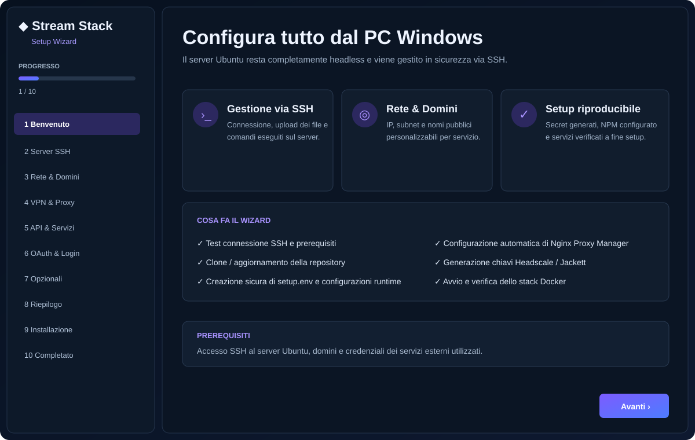
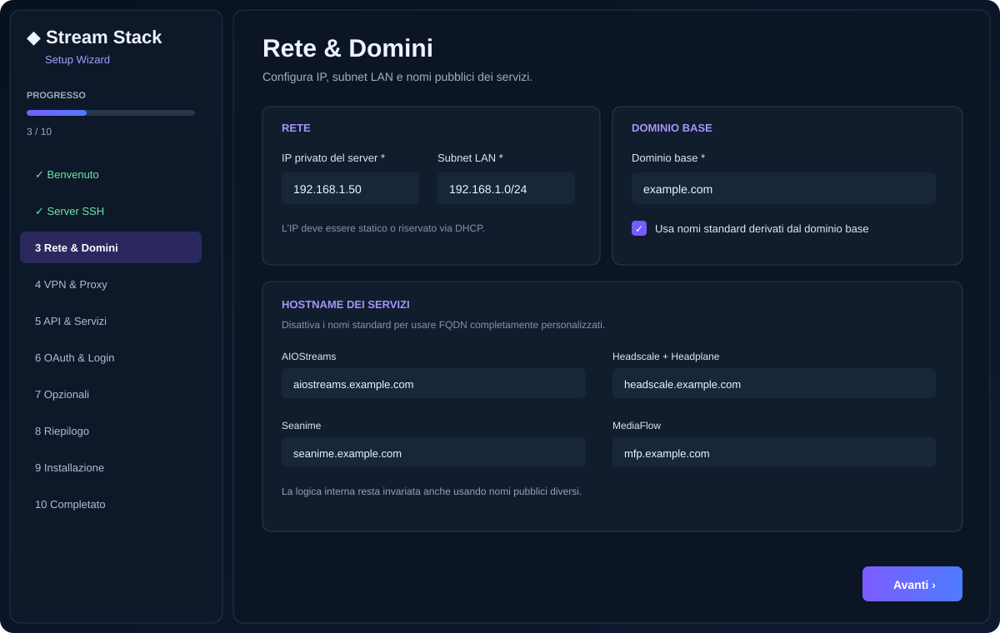
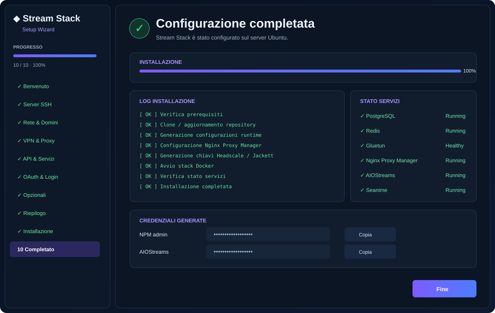

# Stream Stack

<p align="center">
  <strong>Stack Docker self-hosted riproducibile per streaming, metadata, proxy, DNS, VPN e gestione remota.</strong>
</p>

<p align="center">
  
  
  
  
  
</p>

> [!IMPORTANT]
> Questa repository è pensata come **quick setup / disaster recovery**. Non si limita ad avviare dei container: ricostruisce la stessa architettura e la stessa logica operativa dello stack di riferimento, usando però domini, account, token e credenziali propri di chi installa.

---

## Indice

- [Panoramica](#panoramica)
- [Wizard grafico Windows](#wizard-grafico-windows)
- [Architettura attuale](#architettura-attuale)
- [Installazione rapida](#installazione-rapida)
- [Cosa configura automaticamente](#cosa-configura-automaticamente)
- [Domini e Nginx Proxy Manager](#domini-e-nginx-proxy-manager)
- [AIOStreams](#aiostreams)
- [Passaggi ancora manuali](#passaggi-ancora-manuali)
- [Verifica](#verifica)
- [Sicurezza](#sicurezza)

---

# Panoramica

La repo pubblica segue la topologia corrente di `streams-aio`, ma **non contiene le credenziali o lo stato privato dell'installazione sorgente**.

### 31 servizi inclusi

| Area | Servizi |
|---|---|
| Streaming / addon | AIOStreams, Comet, CometNet, StremThru, StreamViX, TvVoo |
| Proxy playback | MediaFlow Proxy Light, EasyProxy |
| Config management | AIOManager |
| Metadata | AIOMetadata |
| Anime | Seanime, Seanime Shared |
| Indexing | Jackett |
| Database | PostgreSQL, PgBouncer, Redis |
| VPN / proxy | Gluetun, MicroWARP, GOST |
| DNS | DNSCrypt Proxy, Cloudflare DDNS |
| Accesso remoto | Headscale, Tailscale, Headplane, OAuth2 Proxy |
| Reverse proxy | Nginx Proxy Manager |
| Gestione | Portainer, Honey, Watchtower, Deunhealth |
| Extra | TeamSpeak |

### Stato non pubblicato

- password, API key e token;
- database applicativi privati;
- certificati e chiavi private;
- identità Headscale / Tailscale / WARP;
- indexer Jackett personali;
- librerie e stato Seanime;
- credenziali Usenet / debrid / provider;
- configurazioni runtime private AIOStreams.

Il setup genera o richiede questi valori localmente.

---

# Wizard grafico Windows

Il server Ubuntu può restare completamente **headless / CLI**. La GUI gira sul PC Windows e lavora sul server via SSH/SFTP.

<p align="center">
  
</p>

Il wizard gestisce:

1. connessione SSH;
2. rete e subnet LAN;
3. dominio base e hostname dei servizi;
4. WireGuard / Gluetun;
5. API esterne;
6. OAuth2 e login applicativi;
7. Nginx Proxy Manager;
8. generazione secret;
9. installazione remota;
10. verifica finale dei servizi.

## Rete e domini

Gli hostname non sono hardcoded. Puoi usare i nomi standard oppure FQDN completamente personalizzati.

<p align="center">
  
</p>

Esempio standard:

```text
aiostreams.example.com
aiometadata.example.com
mfp.example.com
easyproxy.example.com
streamv.example.com
tvvoo.example.com
aiomanager.example.com
headscale.example.com
seanime.example.com
shared-seanime.example.com
cometnet.example.com
stremthru.example.com
portainer.example.com
```

La logica interna resta invariata anche cambiando completamente i nomi pubblici.

## Schermata finale

<p align="center">
  
</p>

Alla fine vengono mostrati log, porte LAN raggiungibili e credenziali generate localmente.

### Avvio su Windows

```powershell
git clone https://github.com/dav1dera/stream-stack.git
cd stream-stack\windows-wizard
```

Poi doppio click su:

```text
Start-Wizard.cmd
```

oppure:

```powershell
.\run.ps1
```

Per generare l'EXE:

```powershell
.\build.ps1
```

---

# Architettura attuale

```text
Internet
   │
Cloudflare DNS
   │
Nginx Proxy Manager
   ├── AIOStreams
   ├── AIOMetadata
   ├── MediaFlow
   ├── EasyProxy
   ├── Headscale
   ├── Seanime / Seanime Shared
   ├── CometNet
   └── servizi LAN-only
         ├── Portainer
         ├── StremThru
         ├── StreamViX
         ├── TvVoo
         └── AIOManager
```

Catena streaming / proxy principale:

```text
AIOStreams
   ├── request URL mapping → StreamViX
   ├── request URL mapping → TvVoo
   ├── request URL mapping → MediaFlow
   ├── request URL mapping → AIOManager
   ├── Comet / StremThru / Jackett
   └── Gluetun → Mullvad
                    └── WARP / GOST fallback

TvVoo ───────┐
StreamViX ───┴──→ EasyProxy → playback HLS
```

Database:

```text
PostgreSQL
   │
PgBouncer :6432
   ├── comet
   ├── stremthru
   └── aiomanager

Redis
   └── servizi cache / metadata
```

DNS locale:

```text
Client LAN → resolver / AdGuard Home esterno → upstream
Docker stack → DNSCrypt Proxy :5353 (disponibile per uso locale/interno)
```

AdGuard Home non viene più eseguito nello stesso Compose: nella topologia corrente è previsto come servizio DNS separato dal Docker stack, così il DNS della LAN non dipende dal ciclo di vita dello stack streaming.

---

# Installazione rapida

## Metodo consigliato — GUI Windows

```text
Windows Wizard → SSH → Ubuntu Server → setup.sh → NPM → Docker Compose
```

Il wizard clona/aggiorna la repo, scrive `setup.env` via SFTP con permessi `0600`, esegue il setup Linux e opzionalmente avvia lo stack completo.

## Metodo CLI

```bash
git clone https://github.com/dav1dera/stream-stack.git
cd stream-stack
./setup.sh
```

Oppure:

```bash
cp setup.env.example setup.env
chmod 600 setup.env
nano setup.env
./setup.sh --non-interactive
```

`setup.env` è l'unica sorgente di configurazione locale da compilare.

---

# Cosa configura automaticamente

### Valori richiesti tipicamente all'utente

| Area | Valori |
|---|---|
| Rete | IP server, subnet LAN, timezone |
| Domini | dominio base e FQDN personalizzati opzionali |
| Cloudflare | API token DNS |
| VPN | WireGuard private key + address CIDR |
| Metadata | TMDB API key/token, TVDB API key |
| Debrid | TorBox API key |
| OAuth | Google Client ID, Client Secret, email consentita |

### Secret generati automaticamente

- password PostgreSQL;
- AIOStreams `SECRET_KEY`;
- password e config key AIOStreams;
- password AIOMetadata;
- password Comet;
- token Comet / CometNet;
- password MediaFlow;
- password EasyProxy;
- chiave cifratura AIOManager;
- secret Headplane;
- cookie secret OAuth2 Proxy;
- password / vault secret StremThru;
- password Seanime e Seanime Shared;
- password NPM su installazione nuova.

I valori condivisi vengono propagati automaticamente nei template corretti.

### Runtime key

Con:

```text
AUTO_RUNTIME_KEYS=true
```

il setup prova anche a:

- rilevare l'API key Jackett;
- creare l'utente Headscale;
- creare la Headscale API key;
- creare una pre-auth key Tailscale;
- rigenerare i file dipendenti.

---

# Domini e Nginx Proxy Manager

NPM viene gestito in modalità **desired state**: un host esistente viene aggiornato, uno mancante viene creato.

| Servizio | Target | Porta | Policy |
|---|---|---:|---|
| AIOStreams | `aiostreams` | 4444 | HTTPS |
| AIOMetadata | `aiometadata` | 1337 | HTTPS |
| MediaFlow | `mediaflow-proxy-light` | 8888 | HTTPS |
| EasyProxy | `easyproxy` | 8760 | HTTPS pubblico |
| Headscale | `headscale` | 8080 | HTTPS + routing Headplane/OAuth |
| Seanime | `gluetun` | 43211 | HTTPS |
| Seanime Shared | `gluetun` | 43311 | HTTPS |
| CometNet | `gluetun` | 8765 | HTTPS / WebSocket |
| Portainer | `portainer` | 9000 | LAN-only |
| StremThru | `gluetun` | 9090 | LAN-only |
| StreamViX | `streamvix` | 7860 | LAN-only |
| TvVoo | `tvvoo` | 5000 | LAN-only |
| AIOManager | `aiomanager` | 1610 | LAN-only |

Le regole LAN-only vengono generate usando **la subnet scelta dall'utente**, non una subnet hardcoded.

## Headscale / Headplane

```text
/                 → Headscale
/admin            → OAuth2 Proxy → Headplane
/oauth2/*          → OAuth2 Proxy
/oauth2/callback   → OAuth2 Proxy
```

---

# AIOStreams

AIOStreams usa l'immagine `nightly` come il deployment corrente.

Il template include anche i mapping interni per evitare round-trip inutili attraverso il dominio pubblico:

```text
StreamViX   → http://streamvix:7860
TvVoo       → http://tvvoo:5000
MediaFlow   → http://mediaflow-proxy-light:8888
AIOManager  → http://aiomanager:1610
```

Per la configurazione runtime completa è consigliato importare un **JSON sanitizzato senza credenziali**, poi aggiungere le proprie chiavi provider/indexer/Usenet.

---

# Fresh install

La repo contiene `docker-compose.override.yml`, caricato automaticamente da Docker Compose, per esporre sulla LAN le due istanze Seanime che condividono il network namespace di Gluetun (`43211` e `43311`).

Questo mantiene il compose principale allineato alla topologia di riferimento senza rompere il bootstrap da zero.

---

# Passaggi ancora manuali

### Jackett

```text
http://SERVER_LAN_IP:9117
```

Aggiungere i propri indexer.

### AIOStreams

Importare il JSON sanitizzato e aggiungere le credenziali private.

### Portainer / Seanime

Completare solo lo stato applicativo personale non pubblicabile.

---

# Verifica

Validazione strutturale inclusa:

```bash
python3 scripts/validate_stack.py
```

Controllo Compose:

```bash
bash scripts/bootstrap.sh
docker compose config --quiet
```

Avvio:

```bash
docker compose --profile all up -d
docker compose --profile all ps
```

Il repository contiene anche una GitHub Action che controlla sintassi Python, struttura attesa dei 31 servizi, template richiesti e validità Docker Compose ad ogni modifica.

---

# Sicurezza

- `setup.env` è ignorato da Git e impostato a `0600`;
- i secret vengono generati localmente;
- i domini e le subnet della configurazione sorgente non vengono hardcodati nel quick setup;
- i servizi LAN-only mantengono la stessa logica ma usano `LAN_SUBNET` dell'installatore;
- nessun database privato viene copiato nella repo pubblica.

> [!WARNING]
> Prima di rendere pubblico un nuovo file proveniente da `streams-aio`, controllare sempre che non contenga token, password, email private, certificati o stato applicativo sensibile.
